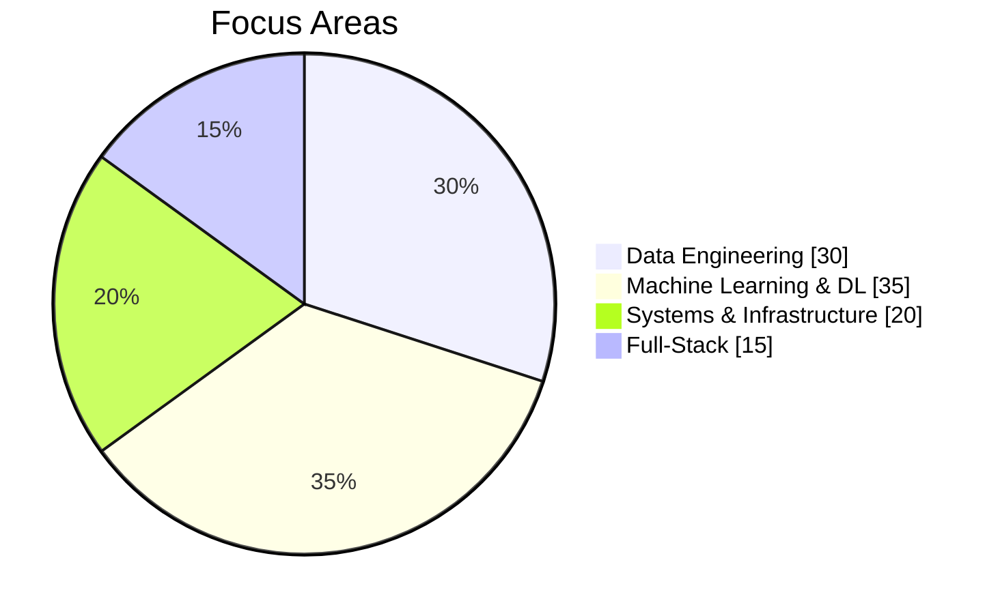

*Bridging computational intelligence and physical systems*

 

  

 

  

---

## About

I build scalable data infrastructure, ML/DL pipelines, and conduct research at the intersection of AI and physics. Focus: production ETL systems, predictive modeling, and physics-informed neural networks.

---

## Experience & Achievements

| Role | Focus |
|------|-------|
| **Data Engineer** | ETL pipelines (Spark, Kafka, Airflow), real-time streaming, data warehousing |
| **ML Research Scientist** | Predictive models (TensorFlow, PyTorch), PINNs, production deployment |
| **Systems Engineer** | Distributed architecture, full-stack solutions (Django, Flask) |

**Highlights:** Scalable data pipelines for real-time analytics | ML models in research & production | Interdisciplinary work in computational physics & PINNs

---

## Expertise

| Domain | Stack |
|--------|-------|
| Data | Spark, Kafka, Airflow, Hadoop |
| ML/DL | TensorFlow, PyTorch, scikit-learn, OpenCV |
| Backend | Python, Django, Flask |
| Data Stores | PostgreSQL, MySQL, MongoDB, Firebase |

---

## Research Interests

Physics-Informed Neural Networks (PINNs) · Scalable data systems · Deep learning optimization · Computational physics · Quantum computing principles

---

## Projects

| Project | Stack |
|---------|-------|
| Data Pipeline Architecture | Spark, Kafka, Airflow, Python |
| ML Research Models | TensorFlow, PyTorch, NumPy, SciPy |
| Full-Stack Applications | Django, Flask, Flutter, PostgreSQL |

[View all on GitHub](https://github.com/Quantumquirkz)

---

## Contact

**jhuobarria@hackatomik.com** · [LinkedIn](https://www.linkedin.com/in/jhuomar/) · Open to collaboration on data engineering, ML, and interdisciplinary research
