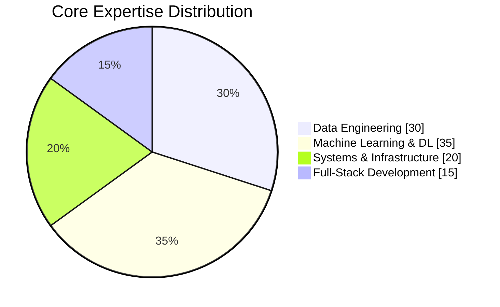

<h1 align="center">Hi, I'm Jhuomar Boskoll Barría Quintero</h1>

<h3 align="center">Computer and Systems Engineer | Data Engineer | Machine & Deep Learning | Research Scientist</h3>

  
  
  
  
  
  
  
  
  
  
  
  
  
  
  
  
  
  
  
  
  
  
  
  
  

###

  
  
  
  

###

  
  

###

  

###

*Bridging computational intelligence and physical systems through data-driven innovation*

---

## Profile Overview

I specialize in building scalable data infrastructure, designing end-to-end machine learning and deep learning pipelines, and conducting research at the intersection of artificial intelligence and physics. My work spans production-grade ETL systems, predictive modeling, and experimental physics-informed neural networks. I am driven by the challenge of transforming complex data into actionable insights and advancing scientific discovery through computational methods.

---

## Technical Skills

### Skills Overview

### Skill Categories

| Domain | Technologies | Proficiency Focus |
|--------|--------------|-------------------|
| **Data Engineering** | Apache Spark, Kafka, Airflow, Hadoop | ETL pipelines, data warehousing, real-time streaming |
| **Machine Learning** | TensorFlow, PyTorch, scikit-learn, NumPy, Pandas | Predictive modeling, neural networks, transfer learning |
| **Backend & Full-Stack** | Python, Django, Flask, PHP | API development, web applications |
| **Databases** | PostgreSQL, MySQL, MongoDB, Firebase, SQLite | Relational and document stores |
| **Tools & Platforms** | Git, Docker, Linux, Arduino, Raspberry Pi | Version control, deployment, IoT |

### Core Technologies

---

## Work Experience

| Role | Focus | Key Deliverables |
|------|-------|------------------|
| **Data Engineer** | Scalable data infrastructure | Designed and implemented ETL pipelines using Apache Spark, Kafka, and Airflow for real-time data processing and stream analytics |
| **ML Research Scientist** | Predictive models and neural networks | Developed production-ready models with TensorFlow and PyTorch; conducted research in physics-informed neural networks (PINNs) |
| **Systems Engineer** | Distributed systems and architecture | Optimized data architectures for scalability and performance; built full-stack solutions with Django and Flask |

---

## Professional Achievements

**Notable Accomplishments**

- Designed and implemented scalable data pipelines handling real-time ETL and stream processing for analytics workloads
- Developed predictive models and neural network architectures deployed in research and production environments
- Led interdisciplinary initiatives at the intersection of machine learning and computational physics
- Contributed to research in physics-informed neural networks and distributed systems optimization
- Built end-to-end data-driven applications with modern web frameworks and cloud deployment

---

## Featured Projects

| Project | Description | Stack |
|---------|-------------|-------|
| **Data Pipeline Architecture** | Enterprise ETL system for real-time data ingestion and processing | Spark, Kafka, Airflow, Python |
| **ML Research Models** | Physics-informed neural networks and predictive modeling for scientific applications | TensorFlow, PyTorch, NumPy, SciPy |
| **Full-Stack Applications** | Data-driven web and mobile solutions for analytics and visualization | Django, Flask, Flutter, PostgreSQL |

*Explore more projects on [GitHub](https://github.com/Quantumquirk31)*

---

## Education

| Degree | Field | Focus |
|--------|-------|-------|
| **B.Sc.** | Computer and Systems Engineering | Software development, data systems, machine learning |

---

## Research Interests

- **Physics-Informed Neural Networks (PINNs)**: Neural networks constrained by physical laws for simulation and prediction
- **Scalable Data Systems**: Real-time pipelines, distributed processing, and data architecture
- **Deep Learning**: Novel architectures, optimization techniques, and transfer learning
- **Computational Physics**: Simulation models, quantum computing principles, scientific computing

---

## GitHub Activity

|  |  |
|-------------------------------------------------------------------------------------------------------------------------------------|-------------------------------------------------------------------------------------------------|

|  |  |
|-----------------------------------------------------------------------------------------------------------------------------------------------------------------------------------------|------------------------------------------------------------------------------------------------|

---

## Languages

| Language | Proficiency |
|----------|-------------|
| Spanish | Native |
| English | Professional Working Proficiency |

---

## Contact

| Channel | Link |
|---------|------|
| **LinkedIn** | [linkedin.com/in/jhuomar](https://www.linkedin.com/in/jhuomar/) |
| **Email** | jhuobarria@hackatomik.com |
| **GitHub** | [github.com/Quantumquirk31](https://github.com/Quantumquirk31) |
| **Stack Overflow** | [stackoverflow.com/users/22577162](https://stackoverflow.com/users/22577162/jhuomar-barría) |

*Open to collaboration on data engineering, machine learning, and interdisciplinary research projects.*

